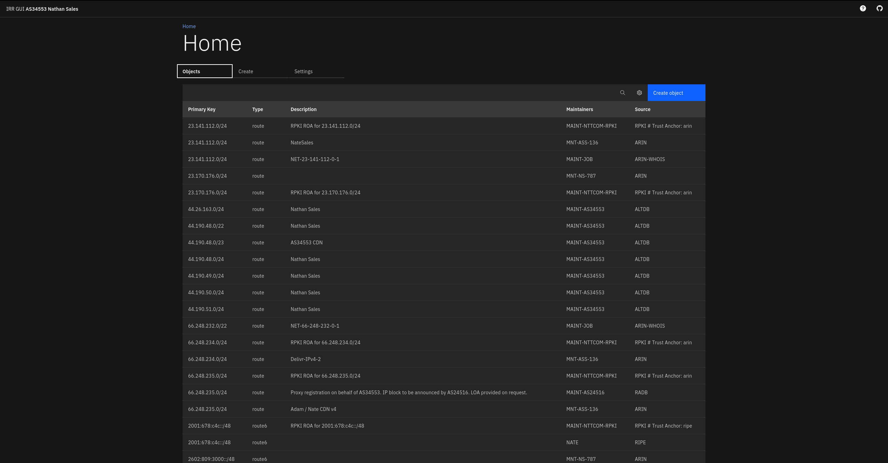

# irr-gui

Web UI for IRR object management.

### Environment variables
| Name                | Usage                        |
| ------------------- | ---------------------------- |
| IRRGUI_ASN          | Your ASN                     |
| IRRGUI_NETWORK_NAME | Your network name            |
| IRRGUI_IRR_SERVER   | IRR server to run queries on |
